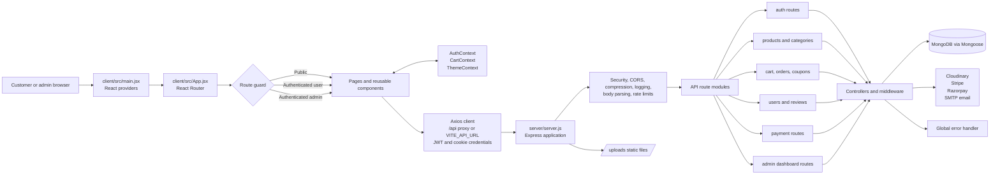
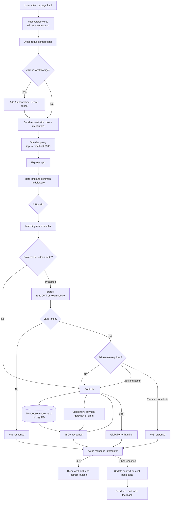
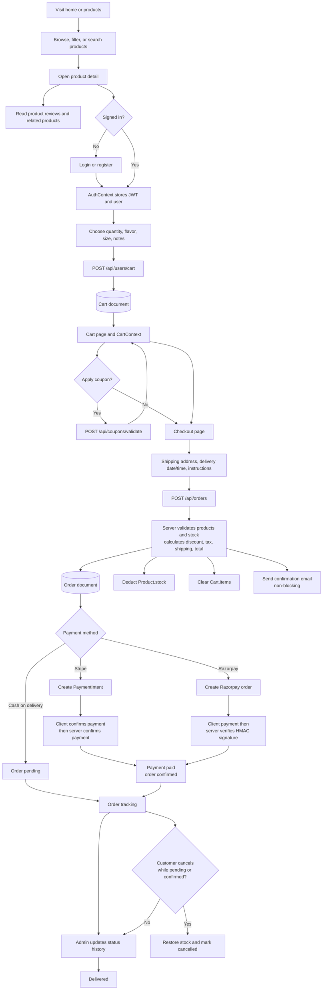
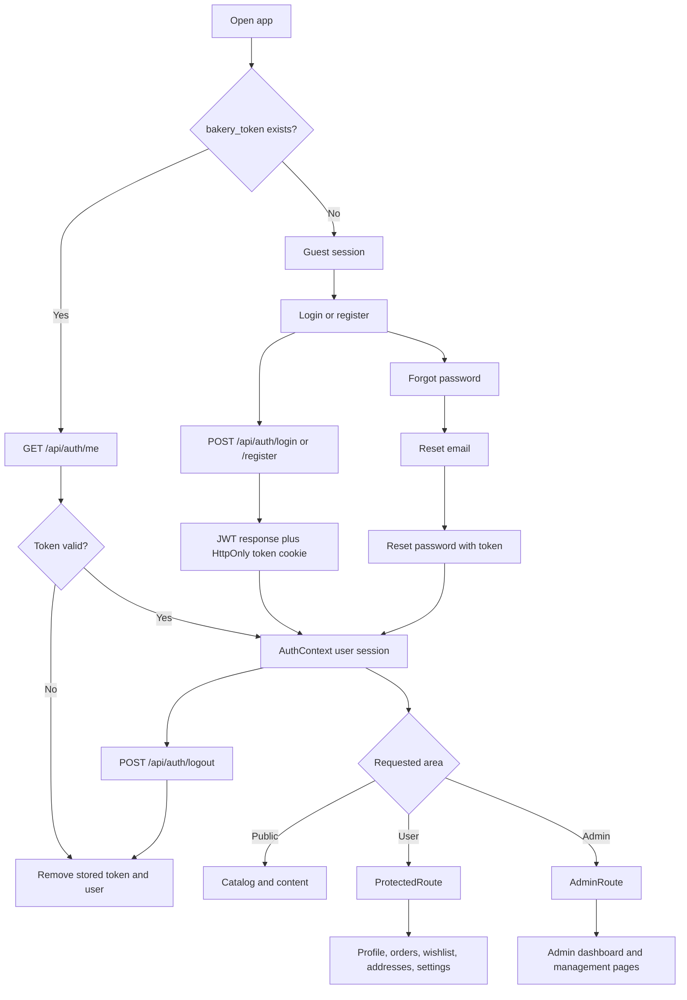
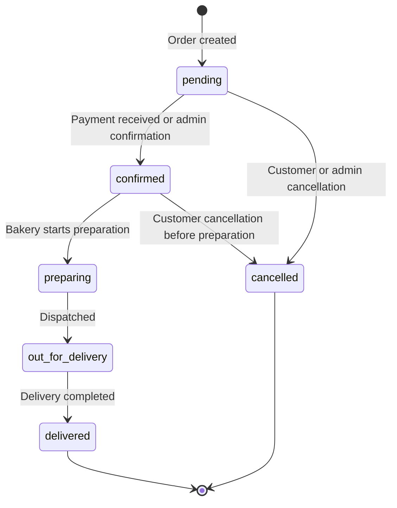

# My Bakery Application Flowchart

This document describes the runtime flow of the MERN application. The diagrams use Mermaid and can be previewed in VS Code or rendered by any Mermaid-compatible Markdown viewer.

## 1. System Flow

## 2. Request Lifecycle

## 3. Customer Purchase Flow

## 4. Authentication and Account Flow

## 5. Route and Domain Inventory

| Client area | API prefix | Main responsibility | Persistence or integration |
|---|---|---|---|
| Home, products, product detail | `/api/products`, `/api/categories`, `/api/reviews` | Catalog, featured items, related items, reviews | `Product`, `Category`, `Review`; Cloudinary for images |
| Login and account recovery | `/api/auth` | Register, login, session verification, password reset, email verification | `User`; SMTP email |
| Cart and wishlist | `/api/users/cart`, `/api/users/wishlist` | Add/update/remove cart items and toggle wishlist | `Cart`, `User`, `Product` |
| Checkout and tracking | `/api/orders` | Create, list, view, cancel, and progress orders | `Order`, `Product`, `Coupon`, `Cart` |
| Online payments | `/api/payments` | Stripe intents/webhook and Razorpay order/signature verification | `Order`; Stripe and Razorpay |
| Profile and addresses | `/api/users/profile`, `/api/users/addresses` | Profile/avatar and saved delivery addresses | `User`; Cloudinary for avatar |
| Coupon validation | `/api/coupons/validate` | Validate customer coupon during checkout | `Coupon` |
| Admin dashboard | `/api/admin/dashboard` | Aggregate operational statistics | `adminController` and domain models |
| Admin management | Shared product/category/order/user/review/coupon prefixes | CRUD and moderation operations | Role guard `authorize('admin')` |

## 6. Order State Flow

## Source Anchors

- Frontend bootstrap and providers: `client/src/main.jsx`
- Frontend route and access decisions: `client/src/App.jsx`, `client/src/components/common/ProtectedRoute.jsx`, `client/src/components/common/AdminRoute.jsx`
- HTTP behavior: `client/src/services/api.js` and `client/src/services/index.js`
- Backend middleware, route mounting, 404, and error handling: `server/server.js`
- Business operations: `server/controllers/`
- Persistence: `server/models/`